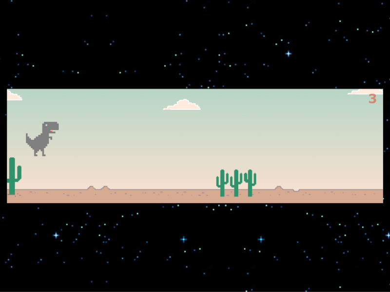

# Juego T-Rex de Google

Este es un clon del famoso juego T-Rex de Google, desarrollado utilizando HTML, CSS y JavaScript. El juego te desafía a controlar a un dinosaurio pixelado mientras evitas obstáculos y tratas de obtener la mayor puntuación posible.

## Características

- Mecánica de juego simple pero adictiva.
- Generación automática de obstáculos para aumentar la dificultad.
- Sistema de puntuación para rastrear tus logros.
- Animaciones suaves y gráficos retro.

## Capturas de pantalla

## Cómo jugar

1. Clona o descarga este repositorio.
2. Abre el archivo `index.html` en tu navegador web.
3. Haz clic en la pantalla o presiona la barra espaciadora para iniciar el juego.
4. Controla al dinosaurio saltando sobre los cactus utilizando la barra espaciadora o la tecla de flecha hacia arriba.
5. Evita chocar con los obstáculos y trata de sobrevivir el mayor tiempo posible.
6. Tu puntuación se muestra en la parte superior derecha de la pantalla.
7. Si fallas y pierdes, puedes reiniciar el juego haciendo clic en la pantalla nuevamente o presionando la barra espaciadora.

## Personalización

Si deseas personalizar el juego o agregar nuevas características, puedes modificar el código fuente fácilmente. El archivo principal es `index.html`, donde encontrarás la estructura HTML básica, en el archivo `style.css` encontraras los estilos del juego y la referencia a la logica del juego la encontraras en el archivo `script.js`.

## Contribuciones

Las contribuciones son bienvenidas. Si tienes alguna idea de mejora o encuentras algún error, siéntete libre de abrir un problema o enviar una solicitud de extracción.

## Autor

[Huari Patey Paz] - [https://huaripaz.github.io/]

